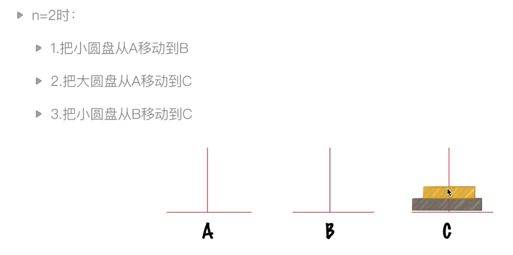
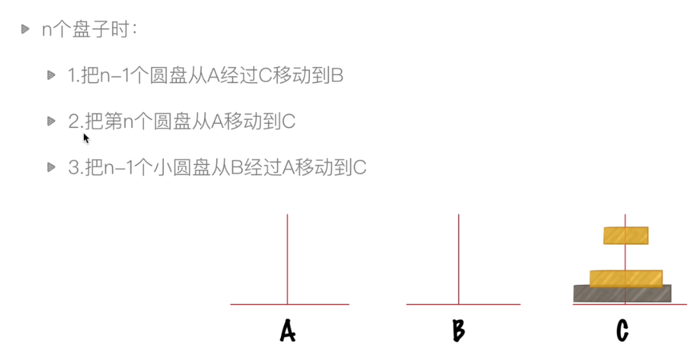

# leetcode

## 一、排序

### [242. 有效的字母异位词](https://leetcode-cn.com/problems/valid-anagram/)

给定两个字符串 s 和 t ，编写一个函数来判断 t 是否是 s 的字母异位词。

注意：若 s 和 t 中每个字符出现的次数都相同，则称 s 和 t 互为字母异位词。

示例 1:

输入: s = "anagram", t = "nagaram"
输出: true
示例 2:

输入: s = "rat", t = "car"
输出: false


思路：

次数相同 -> 长度一样

1.字符串排序 

```python
class Solution(object):
    def isAnagram(self, s, t):
        """
        :type s: str
        :type t: str
        :rtype: bool
        """
        if len(s) != len(t):
            return s == t
        ss=list(s)
        tt=list(t)
        ss.sort() 
        tt.sort()
        return ss==tt

```

2.字典

```python
class Solution(object):
    def isAnagram(self, s, t):
        """
        :type s: str
        :type t: str
        :rtype: bool
        """
        if len(s) != len(t):
            return s == t

        dict1={}
        dict2={}
        for ch in s:
            dict1[ch]= dict1.get(ch,0) +1
        for ch in t:
            dict2[ch]= dict2.get(ch,0) +1       
        return dict1 == dict2     
```

## 二、其他问题

### 1.汉诺塔问题

当n=2时：




当n个盘子时：



```python
def hanoi(n, a, b, c):
    if n>0:
        hanoi(n-1, a, c, b)
        print("moving from %s -> %s" % (a,c))
        hanoi(n-1, b, a, c)

hanoi(4,'A','B','C')
```

第一步：n-1个盘子移动到B（经过C）

第二步：第n个盘子移动到C

第三步：n-1个盘子移动到C（经过A）

