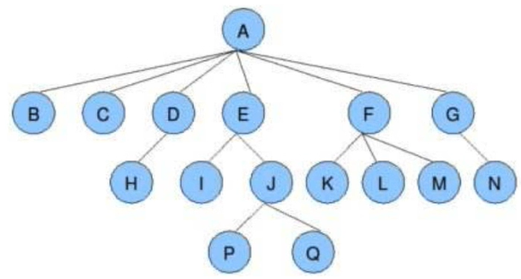
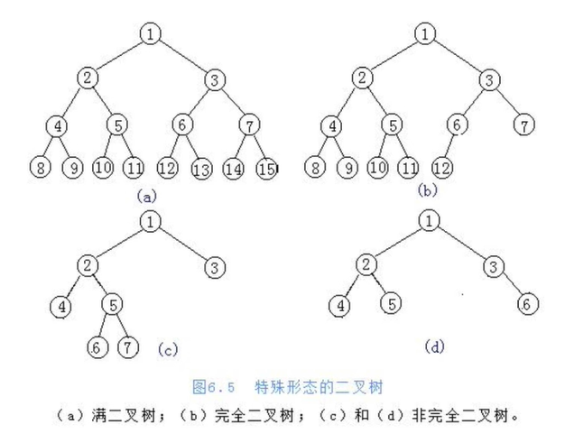
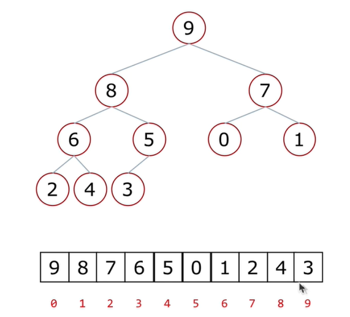

# 排序

## 一、冒泡排序（Bubble sort）

列表每两个相邻的数，如果前面比后面大，则交换这两个数。

一趟排序完成后，则无序区减少一个数，有序区增加一个数。

### 1.时间复杂度：O($$n ^ { 2 }$$)

```python
import  random
def bubb_sort(li):
    for i in range(len(li)-1): # 第i趟
        for j in range(len(li)-1-i):
            if li[j] > li[j+1]:
                li[j], li[j+1] = li[j+1], li[j]
li = [random.randint(0,10000)for i in range(1000)]

```

### 2.小改进：

如果一个列表**其中一趟没有发生交换**，那可以说明已经排好了。

```python
def bubb_sort(li):
    for i in range(len(li)-1): # 第i趟
        exchange = False	# 标志
        for j in range(len(li)-1-i):
            if li[j] > li[j+1]:
                li[j], li[j+1] = li[j+1], li[j]
                exchange = True
        print(li)
        if exchange == False: # 判断标志
            return
        
```


## 二、选择排序（select sort）

### 1.原理

一趟排序记录最小的数，放到第一个位置

再一趟排序记录记录列表无序区最小的数，放到第二个位置

### 2.算法关键点：

有序区和无序区、无序区最小数的位置

### 3.时间复杂度：O($$n^2$$)

```Python
def select_sort(li):
    for i in range(len(li)-1):
        min_val = i
        for j in range(i+1, len(li)):
            if li[j] < li[min_val] :
                min_val = j
        li[i], li[min_val] = li[min_val], li[i]
        
```


## 三、插入排序（insert sort）

### 1.原理

初始时手里（有序区）只有一张牌

每次（从无序区）摸一张牌，插入到手里已有牌的正确位置

### 2.时间复杂度：O($$n^2$$)

```python
def insert_sort(li):
    for i in range(1,len(li)):  # 摸到的牌
        temp = li[i]
        j = i - 1   #手里的牌
        while li[j]>temp and j>=0:
            li[j+1] = li[j]
            j -= 1
        li[j+1] = temp
        
```


## 四、快速排序

### 1.原理


16到 8 +8 做一次partition     一次partition是O(n)

一共有log2（16）层

### 2.时间的复杂度：O(nlogn)

### 3.快排的问题：

1.最坏的情况O($$n^2$$)

2.递归 (递归最大深度)

#### 4.优化：

随机找一个数跟第一个数交换

```python
def quick_sort(li,left,right):
    if left<right:
        mid = partition(li,left,right)
        quick_sort(li,left,mid-1)
        quick_sort(li,mid+1,right)

def partition(li,left,right):
    temp = li[left]
    while left<right:
        while left<right and li[right]>=temp:  #右边大于选的数，right--
            right -= 1
        li[left] = li[right] #退出说明找到比temp小的数，交换
        while left<right and li[left]<=temp :
            left += 1
        li[right] = li[left]
    li[left] = temp
    return left
```


## 五、堆排序

### 1、树的知识

基本概念：

根节点（A）、叶子节点（最末端B,C,H,I,P,Q,K.....）

树的深度（高度）(4层)

树的度（分的叉最多的）（6）   E的度：2

孩子节点/父节点

子树



### 2、二叉树

二叉树：**度不超过2的树**

每个节点**最多**有两个孩子节点

两个孩子节点被区分为左孩子节点和右孩子节点                                                                        

**满二叉树**：一个二叉树，如果**每一个层的结点数都达到最大值**，则这个二叉树就是满二叉树。

**完全二叉树**：叶节点只能出现在**最下层和次下层**，并且最下面一层的结点都**集中在该层最左边**的若干位置的二叉树。



### 3、二叉树的存储方式（表示方式）

（1）链式存储方式

**（2）顺序存储方式   （堆排序）**



父节点和左孩子的关系：

0-1	1-3	2-5 		i - (2i+1)

父节点和右孩子的关系：

0-2	1-4	2-6		i - (2i+2)

孩子找父亲：

(i-1) // 2


### 4、堆

#### 什么是堆

一种特殊的完全二叉树结构

大根堆：一棵完全二叉树，满足任一节点都比其孩子节点大

小根堆：一棵完全二叉树，满足任一节点都比其孩子节点小


#### 堆的向下调整

节点的左右子树都是堆，但自身不是堆

### 5、堆排序过程

1.建立堆。

2.得到堆顶元素，为最大元素

3.去掉堆顶，将堆最后一个元素放到堆顶，此时可通过一次调整重新使堆有序。

4.堆顶元素为第二大元素。

5.重复步骤3，直到堆变空。

```python
"""
range(start, stop[, step])
参数说明：
start: 计数从 start 开始。默认是从 0 开始。例如range（5）等价于range（0， 5）;
stop: 计数到 stop 结束，但不包括 stop。例如：range（0， 5） 是[0, 1, 2, 3, 4]没有5
step：步长，默认为1。例如：range（0， 5） 等价于 range(0, 5, 1)
"""

def sift(li,low,high):  # low堆顶     high最后一个
    i = low
    j = 2 * i +1
    temp = li[low]
    while j <= high:
        if j+1<=high and li[j+1] > li[j]: #两边都有且哪个大
            j = j + 1
        if li[j]>temp:
            li[i] = li[j]
            i = j
            j = 2 * i + 1
        else:
            li[i] = temp	#这个如果注释，topk会忽略某个值？
            break
    else:
        li[i] = temp    # 把temp放在叶子节点

def heap_sort(li):
    n = len(li)
    for i in range((n-2)//2,-1,-1):
        sift(li,i,n-1) #建堆完成
    for i in range(n-1,-1,-1): # 当前堆的最后一个元素
        li[0],li[i] = li[i],li[0]
        sift(li,0,i-1)
```


### 6、时间复杂度：O(nlogn)

sift函数是O(logn)，折半（左边或者右边）

heap_sort是O(n)

所以，时间的复杂度：O(nlogn)


### 7、TopK问题

现在有n个数，设计算法得到前k大的数。(k<n)

解决思路：

排序后切片	O(nlogn)

排序LOwB三人组	O(kn)

堆排序	O(nlogk)

解决思路：

①取列表前k个元素建立一个小根堆。堆顶就是目前第k大的数。

②依次向后遍历原列表，对于列表中的元素，如果小于堆顶，则忽略该元素；如果大于堆顶，则将堆顶更换为该元素，并且对堆进行一次调整；（作比较）

③遍历完所有元素后，倒序弹出堆顶

```python
def topk(li,k):
    heap = li[0:k]
    for i in range((k-2)//2,-1,-1):    #先取前k个建堆
        sift(heap,i,k-1)
    for i in range(k,len(li)):         #从k开始作比较
        if li[i]>heap[0]:
            heap[0] = li[i]
            sift(heap,0,k-1)
    for i in range(k-1,-1,-1):          #出数
        heap[0],heap[i] = heap[i],heap[0]
        sift(heap,0,i-1)
    return heap
```


## 六、归并排序

### 1、原理

分解：将列表越分越小，直至分成一个元素。

终止条件：一个元素是有序的。

合并：将两个有序列表归并，列表越来越大。


### 2、时间复杂度

O(nlogn)

### 3、空间复杂度

O(n)

```python
def merge(li,low,mid,high):
    i = low
    j = mid + 1
    ltmp = []
    while i<=mid and j<=high:
        if li[i]<li[j]:
            ltmp.append(li[i])
            i +=1
        else:
            ltmp.append(li[j])
            j +=1
    # 执行完，有一部分没数，另一部分剩下，判断在哪边，全部填上
    while i<=mid:
        ltmp.append(li[i])
        i += 1
    while j<=high:
        ltmp.append(li[j])
        j += 1
    li[low:high+1] = ltmp

def merge_sort(li,low,high):
    if low<high:
        mid = (low+high)//2
        merge_sort(li, low, mid)    # 左边
        merge_sort(li,mid+1,high)   # 右边
        merge(li,low,mid,high)      # 归并
```


## 七、希尔排序

### 1、原理

希尔排序(Shell Sort)是一种分组插入排序算法

首先取一个整数$$d _ { 1 } = n / 2$$,将元素分为$$d _ { 1 }$$个组，每组相邻量元素之间距离为$$d _ { 1 }$$,在各组内进行直接插入排序；

取第二个整数$$d _ { 2 } = d_{1} / 2$$,重复上述分组排序过程，直到$$d_{i}=1$$,即所有元素在同一组内进行直接插入排序。

希尔排序每趟并不使某些元素有序，而是使整体数据越来越接近有序；最后一趟排序使得所有数据有序


### 2、时间复杂度

很复杂，跟选取的gap有关

```python
def insert_sort_gap(li,gap):
    #重点是gap的位置,原来插入排序的1变成gap
    for i in range(gap,len(li)):   
        temp = li[i]
        j = i - gap
        while li[j]>temp and j>=0:
            li[j+gap] = li[j]
            j -= gap
        li[j+gap] = temp

def shell_sort(li):
    d = len(li)//2            #长度的一半为d
    while d>=1:
        insert_sort_gap(li,d)
        d //= 2
```


## 八、计数排序

### 1、原理

对列表进行排序，已知列表中的数范围都在0到100之间。设计时间复杂度为O(n)的算法。

```python
def count_sort(li,max_count=100):
    count = [0 for _ in range(max_count+1)]
    for val in li:
        count[val] += 1
    li.clear()
    for ind,val in enumerate(count):
        for i in range(val):
            li.append(ind)
```


## 九、桶排序

### 1、原理

在计数排序中，如果元素的范围比较大（比如在到亿之间）如何改造算法？

桶排序(Bucket Sort)：首先将元素分在不同的桶中，在对每个桶中的元素排序。


桶排序的表现取决于数据的分布(集中在某个桶，前面只有几个数)。也就是需要对不同数据排序时采取不同的分桶策略。

### 2、平均情况时间复杂度：$$O(n+k)$$

最坏情况时间复杂度：$$O(n^{2}k)$$

空间复杂度：$$O(nk)$$

```python
def bucket_sort(li,n=100,max_num=1000000):    #一百个桶，最大数10000
    buckets = [[] for _ in range(n)]    #创建桶
    for var in li:
        i = min(var // (max_num//n),n-1)          #var放在几号桶
        buckets[i].append(var)
        #保持桶内顺序
        for j in range(len(buckets[i])-1,0,-1):
            if buckets[i][j] <buckets[i][j-1]:
                buckets[i][j],buckets[i][j-1] = buckets[i][j-1],buckets[i][j]
            else:
                break
    new_li = []
    for buc in buckets:
        new_li.extend(buc)
    return new_li
```


## 十、基数排序

### 1、原理


## 十一、总结

三种排序算法的时间复杂度都是O(nlogn)

一般情况下，就运行时间而言：

**快速排序**<归并排序<堆排序

多三种排序算法的缺点：

快速排序：极端情况下排序效率低

归并排序：需要额外的内存开销

堆排序：在快的排序算法中相对较慢


